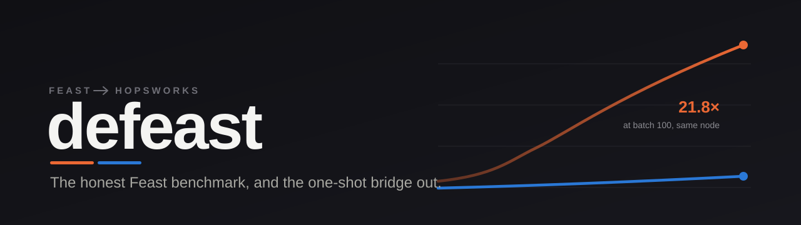

<p align="center">
  
</p>

<p align="center">
  
  
  
  
  
</p>

---

Feast is where most teams meet a feature store for the first time. You `pip install` it and a few hours later you have one running. That is a real strength, and it is also why a lot of people end up assuming Feast is what a feature store is. The space is wider than one open-source project.

This repo does **two independent things** about that. You can use either on its own.

**1. A benchmark.** Feast measured against Hopsworks (ours, biased, obviously) on the four things people actually reach for a feature store to do: online serving, offline retrieval, point-in-time correctness, reusability. One machine, both stores and both clients on it, Feast handed every advantage.

**2. A bridge, `import-feast`.** A tool that reads an existing Feast repo and rebuilds it inside a Hopsworks account, data carried across, one command per side and not a rewrite. So you can try both without redoing your work.

The name is a little tongue-in-cheek. Don't hold that against me.

---

## 1. The benchmark

<p align="center"></p>

One node, both stores and both clients on it, July 2026. No external network on either side: Feast reads Redis on the node, Hopsworks reads RonDB through RDRS on the same node. Taking the network away actually widened the gap, because Hopsworks was the side that used to pay for it.

| Axis | What came out | Winner |
|---|---|---|
| **Online serving** | 4.9x ahead at one row, 21.8x at a hundred, 15.4x at 250 features (p50). The tail is where it matters most for serving, and where the gap is widest: see below. | **Hopsworks** |
| **Offline training data** | Feast's in-memory join wins under ~100k rows. Hopsworks is 3.2x faster at 1M (109s vs 344s), and at 10M Feast runs out of memory with no distributed path to fall back on. | **split** |
| **Point-in-time** | Both leak-free, zero future values on either side. Table stakes. Feast does quietly drop the before-event rows, which thins your early training examples. | **tie** |
| **Reusability** | Reading a feature in two places is parity. Lineage, who-consumes-this, cross-team sharing and access control are native in Hopsworks and missing from Feast's open-source default. | **Hopsworks** |

**Tail latency (p99), the part that decides an online SLA.** At a single row Feast is 10.9 ms p99 against Hopsworks 2.6 ms; at a hundred rows 523.9 ms against 17.0 ms. Under concurrent load the split is starker: Hopsworks holds 456 rps with zero failures and a 1.8 s p99, where `feast serve` saturates near 116 rps and its p99 collapses to 18 s. That is 3.9x the throughput with a bounded tail where Feast's falls over.

So the honest read. Under about 100k offline rows Feast is faster, and with nothing to run it is simpler to start. Once there is real online load, real training-set size, or more than one team touching a feature, Hopsworks pulls ahead and keeps going. Charts, every cell, and the run we threw out for contamination are in [`benchmark/README.md`](benchmark/README.md); the sourced claim-by-claim teardown is in [`docs/claims-teardown.md`](docs/claims-teardown.md).

## 2. The bridge (`import-feast`)

`import-feast` reads a Feast repo through the Feast SDK (it never parses your Python), turns it into a Hopsworks migration plan, and runs it. Storage connectors first, then cached feature groups with the data backfilled, then feature views built from your Feast feature services.

It comes in **two commands** because Feast and the Hopsworks client cannot live in the same Python environment; their dependencies fight. The plan is a JSON file, and that file is the whole handshake between them. You plan on the Feast side, you execute on the Hopsworks side, and yes you can do the two on different machines.

```bash
# 1. read the Feast repo, print and save the plan   (a Feast environment)
pip install -e '.[plan]'
import-feast plan path/to/feast_repo -o plan.json

# 2. run it against Hopsworks                        (a Hopsworks environment)
pip install -e '.[execute]'
import-feast execute plan.json --host <host> --project <project> --api-key-file <key>
```

`plan` writes nothing. It prints, in create order, the connectors, the feature groups, and the feature views, with a warning at every point where a human has to decide something. Read it before you run `execute`.

**What it carries today**, checked end to end against a live cluster:

- Batch feature views over a `FileSource` become cached feature groups, backfilled from the parquet.
- Feast feature services become Hopsworks feature views (the join over the groups underneath).
- Types survive. A Feast `Int32` lands as an `int`, not the `bigint` a lazy parquet read would have guessed, nulls and all.
- Point-in-time survives; a migrated store answers `get_feature_vector` with the same numbers the source Feast repo did.
- Re-running is safe. `execute` upserts on the key, it does not double your rows.

**What it flags but does not yet run.** If your repo reads from a warehouse (BigQuery, Snowflake, Redshift), a stream (Kafka), or has on-demand UDF transforms, the plan shows you the connectors and the warnings, and stops short of building them. Those are the next slices, and I would rather ship them tested against a real warehouse than guess. So for a FileSource repo it is one command each way; for the rest you get a plan and a short list of things to wire by hand.

**Which Hopsworks it runs against.** The `execute` side logs in with the standard `hopsworks` client, so anything that client reaches works: pass `--host` and a project-scoped API key. The end-to-end validation above was run against a **self-hosted** cluster. The [Hopsworks SaaS](https://app.hopsworks.ai) path uses the exact same login and should behave the same, but has not yet been run end to end, so treat it as supported-not-yet-verified until a SaaS run is posted here.

## What's in here

- [`benchmark/`](benchmark/) : the harness, the charts, and the raw results, four axes.
- [`import_feast/`](import_feast/) : the bridge. `plan.py` is the model, `mapper.py` reads Feast, `executor.py` writes Hopsworks, `cli.py` is the two commands.
- [`docs/`](docs/) : [philosophy](docs/PHILOSOPHY.md), [glossary](docs/CONTEXT.md), [principles](docs/PRINCIPLES.md), [invariants](docs/INVARIANTS.md), [claims teardown](docs/claims-teardown.md), [bridge scoping](docs/import-feast-scoping.md).
- `feast/` : a fork of [feast-dev/feast](https://github.com/feast-dev/feast), kept as reference and tracked in its own repo, not vendored here.
