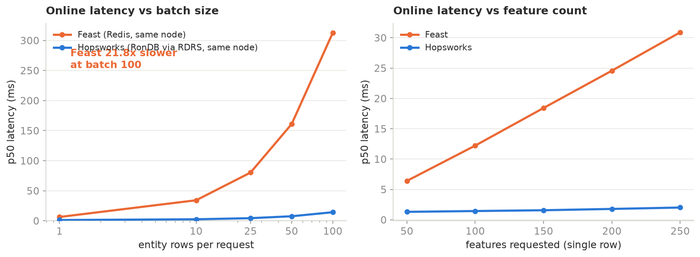
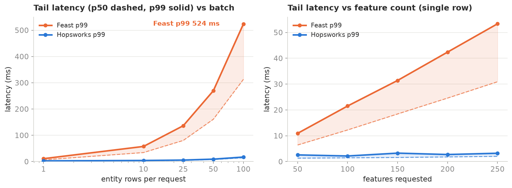
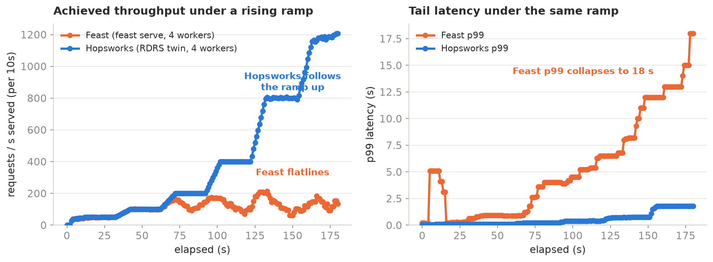
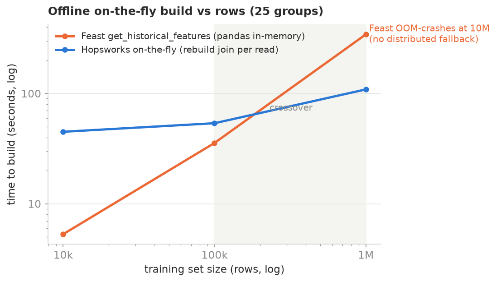
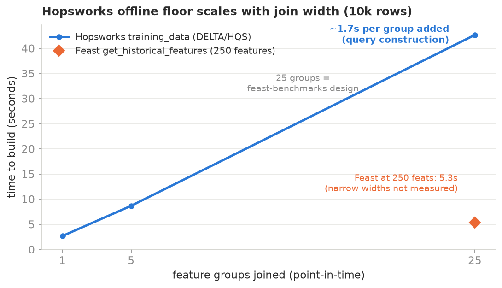
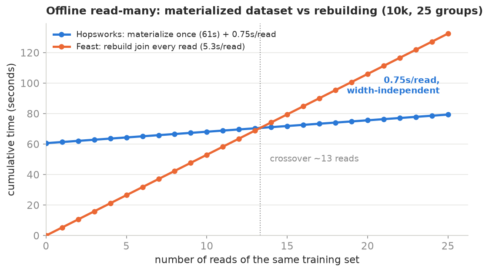

# Benchmark: Feast vs Hopsworks

Head-to-head on the points Feast advertises: low-latency online serving, fast offline retrieval, point-in-time correctness, reusability. Same data, same feature model, same query sweep, same machine, measured at the same layer. Both stores and both clients run on one node (`lex-worker-2`, the RonDB node), so neither side crosses an external network. The setup is reproducible from `setup/k8s/`.

Per-axis detail and raw data are under each axis directory (`latency/`, `throughput/`, `offline/`, `pit/`, `reuse/`, `architecture/`).

## Online serving latency



Hopsworks retrieves online features 4.9x to 21.8x faster at the median, and the gap widens with load. Feast climbs almost linearly with batch size (a 49x slowdown from batch 1 to batch 100, the per-entity Python cost); RonDB stays nearly flat. Both numbers are the default `pip install feast` Python SDK path returning a materialized object, not the alpha Go feature server Feast benchmarks advertise. Detail and all cells: [`latency/RESULTS.md`](latency/RESULTS.md).

The tail is the part an online SLA is written against, and it tracks the median: at a single row Feast is 10.9 ms p99 against Hopsworks 2.6 ms, and at a hundred rows 523.9 ms against 17.0 ms. The full p50/p99 table per query is in [`latency/RESULTS.md`](latency/RESULTS.md).



Under concurrent load (open-loop, matched 4-worker servers), Hopsworks sustains 456 rps with zero failures and a 520 ms median, where `feast serve` saturates near 116 rps and its tail collapses to an 18 s p99. That is 3.9x the throughput under identical conditions. Detail: [`throughput/RESULTS.md`](throughput/RESULTS.md).



The lines are the per-10s achieved rate and tail over the ramp: Hopsworks follows the load up while Feast plateaus, and Feast's p99 climbs to 18 s where Hopsworks stays near 1.8 s. The 456 vs 116 rps headline figures are the whole-run averages.

## Offline training data

Building a training dataset (N unique entities, 250 features, point-in-time join across 25 groups) has two patterns with very different costs, and they land on opposite verdicts.

**On-the-fly build** (both stores rebuild the join each call: Feast `get_historical_features`, Hopsworks `training_data`):



Feast's in-memory pandas join wins below about 100k rows. Above the crossover Hopsworks pulls away (3.7x at 1M) and at 10M Feast OOM-crashes with no distributed fallback while Hopsworks completes via Spark. The small-N loss is real, not an API artifact: `training_data` (51s at 10k/25 groups) is no faster than `get_batch_data` (45s). It is also join-width bound, 3.0s at 1 group to 52s at 25 (below), dominated by backend query construction, reproduced on two clusters and with `online_enabled` on or off.



**Materialize once, read many** (the training loop: materialize a dataset, read it every epoch or experiment):



Hopsworks materializes a versioned dataset once (61s at 10k/25 groups) then reads it in **0.75s**, width-independent (the join is baked into the stored table). Feast has no materialized offline dataset, so every read is another 5.3s `get_historical_features`. Cumulatively Hopsworks overtakes at ~13 reads, and per read after that it is 0.75s vs 5.3s. This is the pattern real training uses, and the first version of this axis missed it by measuring only the on-the-fly build with the wrong API. Detail and the full method table: [`offline/RESULTS.md`](offline/RESULTS.md).

## Point-in-time correctness and reusability

Two axes where the honest answer is not "Hopsworks wins", so they get no chart.

- **Point-in-time**: both stores are leak-free, 0 future leakage on either side. Table stakes, not a Feast differentiator. Feast does silently drop rows with no as-of value (before-event labels), which quietly removes early training examples. [`pit/RESULTS.md`](pit/RESULTS.md).
- **Reusability**: read-level reuse (define once, read many) is parity. Reverse lineage, model-to-feature provenance, cross-team sharing, and RBAC are native in Hopsworks and absent from Feast's open-source default. [`reuse/RESULTS.md`](reuse/RESULTS.md).

## Architecture

What you operate to serve features in production, and the online read path of each store, scoped honestly (not a naive platform pod count). Moving-parts matrix, read-path diagrams, and the serving-component footprint in [`architecture/README.md`](architecture/README.md).

## Setup

Both sides run on one host (96 cores, 377 GB). Data and feature model are identical, generated by the Feast team's own `data_generator.py` (10k rows, 250 int64 features, entity keyspace 10k). The feature model mirrors `feast-dev/feast-benchmarks`: 25 groups of 10 features each, retrieved in bundles of 50 to 250 features (5 to 25 groups joined on `entity`).

- Feast: 25 feature views + 5 feature services, online store Redis 7, `feast materialize-incremental`. `setup/feast_repo/`.
- Hopsworks: 25 feature groups + 5 feature views, online store RonDB. `setup/hops_setup.py`.

`feast_bench.py` and `hops_bench.py` measure the same thing: single-thread, warm, per-call wall time of an online retrieval over a sweep. Sweep A varies batch size (1 to 100) at 50 features; sweep B varies features (50 to 250) at batch 1. Per cell: 50 warmup calls, then 300 measured, random entities. Report p50, p90, p99, p99.9, mean, single-thread QPS.

## Reproduce

The Hopsworks scripts read the target from the environment: `HOPSWORKS_HOST` and an API key at `HOPSWORKS_API_KEY_FILE` (default `~/.hw_bench_key`).

```
# data + feast
python data_generator.py                 # from the feast-benchmarks fork
cd setup/feast_repo && feast apply && feast materialize-incremental $(date -u +%FT%T)
python latency/feast_bench.py                     # -> results_feast.jsonl

# hopsworks
export HOPSWORKS_HOST=your.hopsworks.host
python setup/hops_setup.py                      # 25 FGs + 5 FVs, materialize to RonDB
python latency/hops_bench.py                      # -> results_hops.jsonl
```

Results land as JSONL, one object per cell. `report.html` is a self-contained rendered comparison (interactive charts, same data).

## Security note

The Redis online store must bind to `127.0.0.1` only, never `0.0.0.0`. The benchmark host is shared and internet-facing. An early run bound Redis on `0.0.0.0:6379` and within minutes an automated scanner hit it and injected Redis cron-injection payloads (the classic `SET` a crontab entry, `CONFIG SET dir`, `SAVE` attack pointing at a remote miner dropper). It was fully contained by rootless podman: the container Redis runs as an unprivileged user with `dir=/data` inside its own mount namespace, so it could not reach the host crontab, and the host was verified clean (no user crontab, no matching entries in `/etc/cron.d` or `/var/spool/cron`, no outbound connections, no miner process). The store now runs on `127.0.0.1:6771` with `--bind 127.0.0.1 --save '' --appendonly no`. The first Feast SDK run overlapped this window and was re-run on the clean, isolated store.
