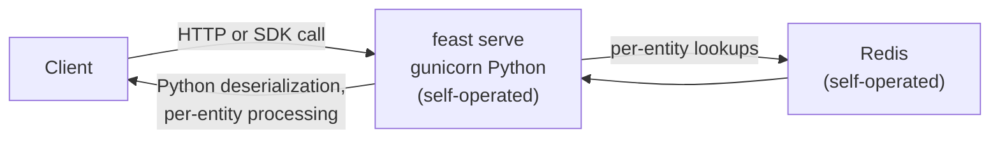
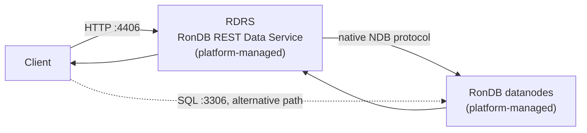

# Architecture: what you operate to serve features

This comparison is scoped to two things: the components on the online read path, and the moving parts a user must deploy, run, monitor and scale themselves to serve features in production. It is not a platform-wide pod count.

The scoping matters because the naive comparison is dishonest in both directions. Hopsworks deploys as an integrated platform of roughly 99 pods, but that platform includes jobs, UI, lineage, monitoring, notebooks and more, none of which is a feature-serving component. Comparing "99 Hopsworks pods" to "2 Feast processes" compares a datacenter to a laptop. The honest question is narrower: to serve features online in production, what runs on the request path, and who is responsible for each piece.

## Moving parts you operate

| Component | Feast (who runs it) | Hopsworks (who runs it) |
|---|---|---|
| Online store | Redis. You deploy, size, persist, monitor and scale it yourself. Feast ships the client, not the store. | RonDB. Ships with the platform, managed as part of it. You do not deploy or operate it separately. |
| Registry | A file on S3 or local disk by default. At scale, a Postgres or other SQL registry that you run yourself. | Platform metadata service, included. Nothing separate to run. |
| Materialization / compute | Your own. Feast does not compute features; you bring Spark or your own pipelines, plus the scheduling and monitoring for them, and run `feast materialize` on your own cadence. | In-platform (Spark, Flink, pandas). Scheduling and execution are part of the platform. |
| Feature server | `feast serve`, a gunicorn Python server (or the alpha Go server). You deploy it, scale it horizontally, and watch it saturate. | RDRS (RonDB REST Data Service). Deployed and scaled as a platform component. |
| Scaling and monitoring | Yours, per component: Redis memory and eviction, registry contention, materialization lag, server replica count. Four independent things to instrument. | Platform-level. One system to monitor, operated as a whole. |

The asymmetry is in the "who" column, not the component list. Both stores need all five functions. Feast delegates four of them to you.

## The online read path

### Feast

Every component past the client is self-operated. The `feast serve` hop does per-entity Python work (protobuf decode, response assembly) on the request path, which is the cost a purpose-built store avoids and the reason Feast latency climbs with batch size (see [`latency/RESULTS.md`](../latency/RESULTS.md)).

### Hopsworks

Both components are platform-managed. The client can also read RonDB directly over the SQL path on port 3306; the benchmark and the default SDK use RDRS.

## Serving-component footprint

Serving components only, measured on the live benchmark deployment. This is not the whole Hopsworks platform and is not meant to be: the rows below are the processes that actually sit on the online read path, on each side.

| Component | Resident memory (RSS) | CPU under load | Processes / containers |
|---|---|---|---|
| Feast: Redis (bench-redis) | `<RSS: TBD>` | `<CPU: TBD>` | `<count: TBD>` |
| Feast: feast serve (gunicorn) | `<RSS: TBD>` | `<CPU: TBD>` | `<count: TBD>` |
| Hopsworks: RDRS pod | `<RSS: TBD>` | `<CPU: TBD>` | `<count: TBD>` |
| Hopsworks: RonDB datanode pod | `<RSS: TBD>` | `<CPU: TBD>` | `<count: TBD>` |

Fill from `footprint.sh` run on the benchmark host with `KUBECONFIG` set. The Feast rows are host processes under load from the latency sweep; the Hopsworks rows are `kubectl top` on the serving pods, which include platform baseline traffic (assumption: the benchmark is the dominant load during capture).

## Failure modes

What breaks, and who has to notice and fix it.

**Feast** (you notice, you fix):

- Redis eviction or OOM. Under memory pressure Redis silently evicts feature rows or crashes. Serving returns nulls or errors. You own the memory sizing, the eviction policy, and the alerting.
- Registry races. Concurrent `feast apply` against the file registry can clobber definitions; the SQL registry moves the problem to a database you also run.
- Materialization lag. `feast materialize` is your pipeline on your schedule. If it falls behind or fails, online features go stale with no built-in freshness alarm. You build the lag monitoring.
- Feature server saturation. The gunicorn Python server does per-entity work per request; under load it saturates workers. You detect it, add replicas, and load-balance them yourself.

**Hopsworks** (platform-managed, but real):

- RDRS capacity. The REST service can saturate under high concurrency; it is scaled as a platform component, but capacity planning is still a decision someone makes.
- RonDB memory sizing. RonDB is an in-memory store; the datanodes must be sized for the online feature set. Undersize them and writes fail, which is loud rather than silent, but still a sizing exercise.
- Platform coupling. When a platform-level issue occurs, the serving path is inside it. You debug one integrated system with its vendor, instead of four small ones alone.

The difference is not that Hopsworks cannot fail. It is that the Feast failure modes each need monitoring you build, on components you assembled, with no one else on the hook.

## The honest read

Feast is genuinely simpler on day one. `pip install feast`, a local Redis, a file registry, and you are serving features in an afternoon. Nothing in this document takes that away, and for a prototype it is the right trade.

The inversion happens at production. The pip install was never the system; it was the client to a system you now assemble: a Redis deployment you size and monitor, a registry you migrate off the file when concurrency bites, materialization pipelines you build because Feast computes nothing, and a Python server you replicate when it saturates. Four operated components, each with its own failure modes and its own on-call surface. Hopsworks is the opposite trade: a heavier platform you install once and do not assemble, where the serving path (RDRS to RonDB) arrives managed, sized and monitored as part of the whole. Fewer parts to start versus fewer parts to run. Which trade is right depends on whether you are prototyping or operating.
